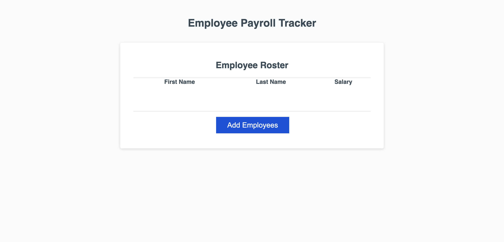

## Description

This Employee Management System is a web-based application designed to help organizations collect, manage, and analyze employee data. This system allows users to input employee information, calculate the average salary, display employee data in a structured table, and select a random employee to highlight.

## Features

**Employee Data Collection**: Collects data such as first name, last name, and salary for each employee through user input.
- **Average Salary Calculation**: Computes and displays the average salary of all entered employees.
- **Data Display**: Showcases all employee data in a well-structured HTML table, making it easy to view and assess employee information at a glance.
- **Random Employee Highlight**: At any given time, the system can select and display a random employee's details, adding an element of surprise and engagement to the data interaction process.

## Visuals

## Deployment

Provided as a link here - [Module 01](https://vgalante2.github.io/Payroll_Tracker/)

## Usage

To use the webpage, you can review each section by clicking on the header links at the top of the page. To inspect each element, you can open the Chrome DevTools by pressing Command+Option+I (macOS) or Control+Shift+I (Windows). A console panel should open either below or to the side of the webpage in the browser. There you can navigate to the Accessibility tab to highlight each picture element,

## License

edited by vin galante 

MIT License 